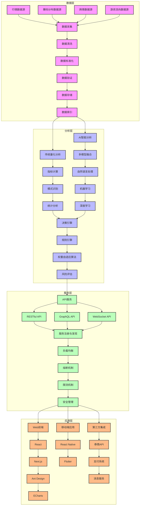
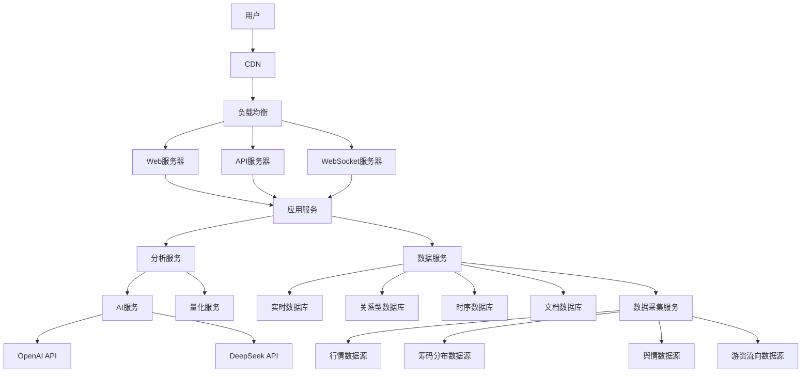

# A-RadarX 3.2.0 架构概述

## 1. 系统架构总览

A-RadarX 3.2.0 采用分层架构设计，确保系统的可扩展性、可维护性和高性能。系统从下到上分为四个主要层次：数据层、分析层、服务层和应用层。

## 2. 分层架构详解

### 2.1 数据层

数据层负责多源数据的采集、存储和管理，为上层提供统一的数据访问接口。

#### 2.1.1 数据源
- **行情数据源**：提供实时股票行情数据，包括价格、成交量、涨跌幅等
- **筹码分布数据源**：提供股票筹码分布数据，包括集中度、支撑位、压力位等
- **舆情数据源**：提供市场舆情数据，包括新闻、社交媒体、研报等
- **游资流向数据源**：提供游资席位交易数据，包括买入、卖出、净成交量等

#### 2.1.2 数据存储
- **实时数据库**：Redis，用于存储实时行情数据和热点数据
- **关系型数据库**：PostgreSQL，用于存储结构化数据，如用户信息、配置信息等
- **时序数据库**：InfluxDB，用于存储时间序列数据，如历史行情数据、指标数据等
- **文档数据库**：MongoDB，用于存储非结构化数据，如舆情文本、分析报告等

#### 2.1.3 数据处理
- **数据清洗**：去除噪声数据，统一数据格式
- **数据标准化**：将不同数据源的数据转换为统一格式
- **数据验证**：确保数据的完整性和准确性
- **数据索引**：建立高效的数据索引，提高查询性能

### 2.2 分析层

分析层是系统的核心，负责数据的分析和处理，生成有价值的分析结果。

#### 2.2.1 传统量化分析
- **技术指标计算**：WAD、RSI、MACD等技术指标的计算
- **模式识别**：识别K线形态、趋势等
- **统计分析**：相关性分析、回归分析等

#### 2.2.2 AI 智能分析
- **多模型融合**：整合OpenAI、DeepSeek等模型的分析结果
- **自然语言处理**：舆情分析、文本分类、情感分析
- **机器学习**：预测模型、分类模型、聚类模型
- **深度学习**：神经网络模型、强化学习模型

#### 2.2.3 决策引擎
- **规则引擎**：基于规则的决策逻辑
- **权重自适应算法**：根据市场情况自动调整指标权重
- **风险评估**：评估投资风险，生成风险等级

### 2.3 服务层

服务层负责提供统一的服务接口，包括API服务、实时推送服务等。

#### 2.3.1 API 服务
- **RESTful API**：提供标准的RESTful接口
- **GraphQL API**：支持灵活的数据查询
- **WebSocket API**：提供实时数据推送

#### 2.3.2 服务管理
- **服务注册与发现**：基于Consul的服务注册与发现
- **负载均衡**：基于Nginx的负载均衡
- **熔断机制**：基于Hystrix的服务熔断
- **限流机制**：基于Redis的限流

#### 2.3.3 安全管理
- **认证与授权**：基于JWT的认证与授权
- **API Key管理**：API Key的生成、验证和管理
- **加密传输**：基于HTTPS的加密传输
- **数据加密**：敏感数据的加密存储

### 2.4 应用层

应用层负责为用户提供交互界面，包括Web前端、移动端应用等。

#### 2.4.1 Web前端
- **React**：前端框架
- **Next.js**：服务端渲染
- **Ant Design**：UI组件库
- **ECharts**：数据可视化

#### 2.4.2 移动端应用
- **React Native**：跨平台移动应用开发
- **Flutter**：高性能移动应用开发

#### 2.4.3 第三方集成
- **券商API**：与券商系统的集成
- **支付系统**：与支付系统的集成
- **消息服务**：与短信、邮件服务的集成

## 3. 数据流向图

## 4. 核心模块详解

### 4.1 AI 会诊模块

AI 会诊模块是 3.2.0 版本的核心功能，通过整合多个 AI 模型的分析结果，提供更全面、更可靠的投资建议。

#### 4.1.1 工作流程
1. 收集多维度股票数据
2. 生成 AI 提示词
3. 调用多个 AI 模型进行分析
4. 整合分析结果
5. 生成最终的投资建议

#### 4.1.2 关键技术
- **多模型融合算法**：加权平均、投票机制、堆叠集成
- **提示词工程**：优化提示词，提高模型输出质量
- **结果解析**：将自然语言响应转换为结构化数据

### 4.2 AI 自省模块

AI 自省模块负责系统的自我评估和优化，通过对历史分析结果的回顾和评估，不断改进模型性能。

#### 4.2.1 工作流程
1. 定期对历史分析结果进行回溯
2. 计算预测准确率和收益率
3. 识别模型的优势和不足
4. 自动调整模型参数和权重
5. 生成性能报告

#### 4.2.2 关键技术
- **回溯测试**：历史数据回测
- **性能评估**：准确率、收益率、风险指标
- **自动优化**：参数调优、模型选择、权重调整

### 4.3 权重自适应模块

权重自适应模块负责根据市场情况自动调整技术指标的权重，提高分析的准确性。

#### 4.3.1 工作原理
- 基于历史数据计算各指标的预测能力
- 根据市场环境动态调整指标权重
- 实现权重的自动学习和优化

#### 4.3.2 关键算法
- **加权平均算法**：动态调整各指标的权重
- **自适应学习算法**：基于市场反馈调整权重
- **非线性优化算法**：寻找最优权重组合

## 5. 系统部署架构

### 5.1 部署环境
- **操作系统**：Linux（CentOS/Ubuntu）
- **容器化**：Docker
- **编排工具**：Kubernetes
- **云平台**：支持阿里云、腾讯云、AWS、Azure等主流云平台

### 5.2 部署架构

### 5.3 高可用设计
- **多节点部署**：关键服务多节点部署，避免单点故障
- **负载均衡**：均衡分配请求，提高系统吞吐量
- **故障转移**：自动检测故障并转移请求
- **数据备份**：定期备份数据，确保数据安全
- **容灾方案**：跨区域部署，提供容灾能力

## 6. 系统性能优化

### 6.1 性能瓶颈分析
- **数据访问**：数据库查询性能
- **计算密集型任务**：AI模型推理、指标计算
- **网络通信**：API调用、数据传输
- **内存管理**：内存泄漏、内存碎片

### 6.2 优化策略
- **数据库优化**：索引优化、查询优化、分库分表
- **缓存策略**：多级缓存、热点数据缓存
- **并发处理**：多线程、异步处理、并行计算
- **资源管理**：连接池、线程池、内存池
- **代码优化**：算法优化、数据结构优化

## 7. 系统监控与维护

### 7.1 系统监控
- **性能监控**：CPU、内存、磁盘、网络等资源监控
- **服务监控**：服务状态、响应时间、错误率等
- **数据监控**：数据质量、数据延迟、数据完整性等
- **安全监控**：入侵检测、异常访问、安全事件等

### 7.2 系统维护
- **日志管理**：集中日志管理、日志分析、日志告警
- **告警系统**：异常告警、性能告警、安全告警
- **自动化运维**：自动化部署、自动化测试、自动化修复
- **版本管理**：代码版本控制、配置版本控制、数据版本控制

## 8. 未来架构规划

### 8.1 功能扩展
- **支持更多资产类别**：基金、期货、期权等
- **引入更多AI模型**：自研模型、行业专用模型
- **提供个性化服务**：基于用户画像的个性化推荐

### 8.2 技术升级
- **边缘计算**：将计算能力下沉到边缘节点
- **分布式计算**：提高系统的计算能力和扩展性
- **量子计算**：探索量子计算在金融分析中的应用
- **区块链技术**：提高数据的安全性和透明度

### 8.3 生态建设
- **开放平台**：提供开放API，支持第三方应用接入
- **开发者社区**：建立开发者社区，促进技术交流和创新
- **合作伙伴生态**：与券商、基金公司、研究机构等建立合作关系
